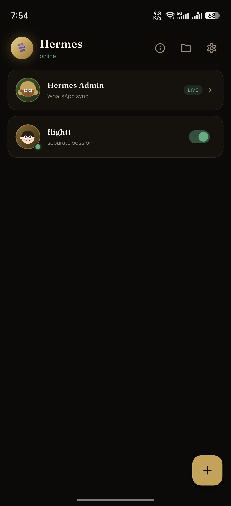
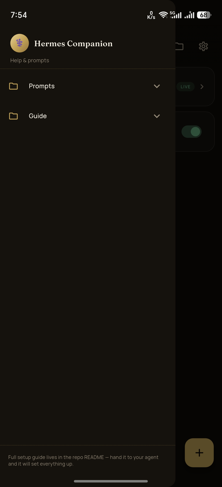
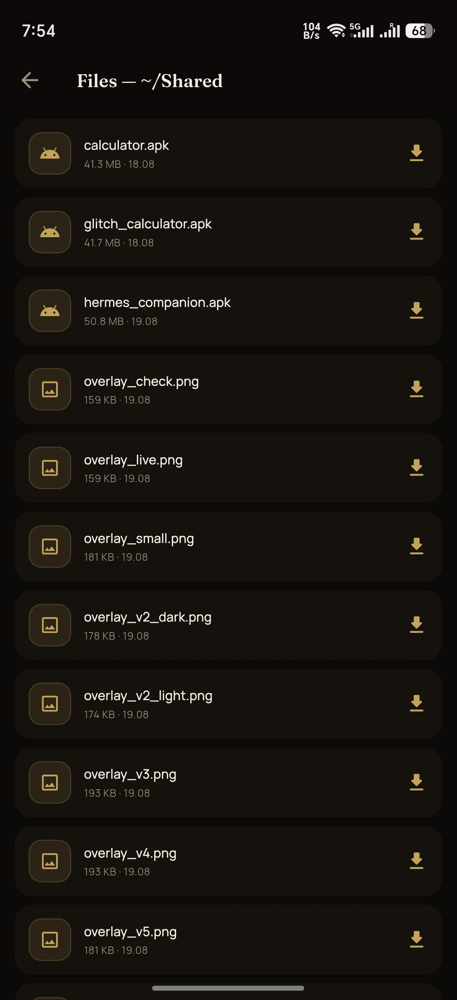
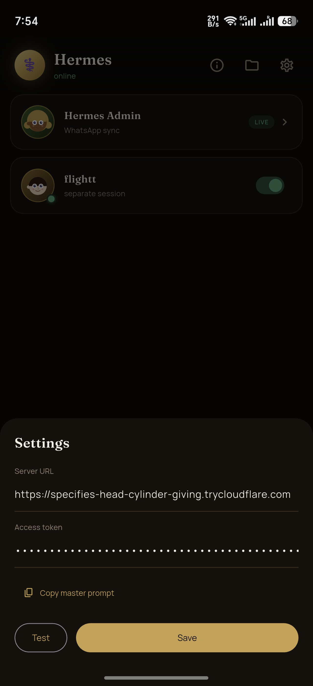

# Hermes Companion

Hermes Companion is a private chat app for Android that connects you to your
own AI agent running on your machine. Instead of talking to your agent through
WhatsApp, Telegram, or a web interface, you get a dedicated messenger: send
messages and files, receive markdown-formatted replies, and get notified when
your agent finishes a task. The app is a Flutter client; the backend is a small
FastAPI relay that runs next to your agent and provides the connection.

The project is fully self-hosted. Conversations, files, and history stay on
your hardware, and the relay can be reached from anywhere over the internet via
Cloudflare Tunnel, Tailscale, or a reverse proxy.

## Screenshots

| Chat list | Chat | Files | Onboarding |
|---|---|---|---|
|  |  |  |  |

## Features

- Self-hosted chat channel for your own AI agent (local LLM, Claude, or any
  agent with a small HTTP hook)
- Markdown-rendered replies (bold, code blocks, lists, links)
- File and image sharing in both directions
- Offline support: an outbox queues messages until the relay is reachable, and
  a local cache keeps recent messages readable without a connection
- Per-session power toggles: pausing a chat stops its agent process entirely,
  using zero system resources; the session state is shown as red/green dots
- Unread badges, per-chat mute, and background notifications through an Android
  foreground service
- First-run onboarding: paste a pairing link and the app connects; a single
  "master prompt" can make your agent configure the whole relay automatically

## How it works

The phone runs the Flutter app. The machine runs a small FastAPI relay that
implements a documented REST API (see below) and exposes one hook your agent
implements (`run_agent`). The app and the relay authenticate with a bearer
token. For remote access the relay is exposed through Cloudflare Tunnel,
Tailscale, or a TLS reverse proxy, so no open ports are required.

## Quick start

1. Build and install the APK (see Build) or use a prebuilt release.
2. On first launch the app shows a pairing screen.
3. Paste a pairing link from your agent, or enter the server URL and token
   manually, then test the connection.
4. The app lists your chats. The main chat is the admin and sync channel and is
   always pinned at the top.

To get a pairing link, copy the master prompt from the app (onboarding screen,
or Settings > Help) and send it to your agent. The agent generates a token,
starts the relay, and replies with a single line:

```
hermes://pair?url=<URL-ENCODED-BASE-URL>&token=<TOKEN>
```

Paste that line into the app and connect. The app verifies the connection and
saves the settings; it will not ask again unless you change them in Settings.

### Pairing instructions for the agent

If you are the agent receiving the master prompt, here is what to do:

1. Generate a random bearer token (`openssl rand -hex 24` or similar) and keep
   it in a config file or environment variable.
2. Run the relay (see the reference implementation in `relay/relay.py`) on port
   8124, bound to `0.0.0.0`, and make it reachable from the internet: Cloudflare
   Tunnel, Tailscale, or a VPS with TLS. A LAN-only URL works for local use.
3. Reply with exactly one line, nothing else:
   `hermes://pair?url=<URL-ENCODED-BASE-URL>&token=<TOKEN>`, where `url` is the
   full base URL the phone can reach (URL-encoded, `https` preferred) and
   `token` is the token from step 1.

## API contract

All endpoints are relative to the relay base URL and return JSON. Requests may
include `Authorization: Bearer <token>`; the relay should reject invalid tokens
with `401`, which the app treats as "unauthorized".

| Method | Path | Query / Body | Response |
|---|---|---|---|
| `GET` | `/api/health` | | `200` `{"ok": true}` |
| `GET` | `/api/chats` | | `{"chats": [{id, name, lastId, isMain, avatar, lastTs}]}` — `lastTs` (unix seconds of the last message) is optional but lets the app sort chats by recency |
| `GET` | `/api/chat` | | `{"chatId": "main", "displayName": "Hermes", "lastId": 42}` (the main chat) |
| `POST` | `/api/chat/new` | body `{"name": "Trip Planning"}` | `200` `{"id": "...", "name": "..."}` |
| `DELETE` | `/api/chat/<id>` | | `200` — must also terminate that chat's agent session and delete all its messages. The main chat must be refused. |
| `POST` | `/api/chat/<id>/pause` | | `200` — stop this chat's agent session (zero resources) |
| `POST` | `/api/chat/<id>/resume` | | `200` — start this chat's agent session again |
| `GET` | `/api/messages` | `after=<int>&chat=<id>` | `{"messages": [{id, role, text, ts, media: [paths]}], "lastId": N}` |
| `POST` | `/api/send` | body `{"text": "...", "chat": "<id>", "media": [paths]}` | `200` |
| `GET` | `/api/status` | | `{"chats": {<id>: {"status": "idle"\|"running", "since": epoch_s, "detail": "...", "paused": false}}}` — `paused: true` means the session is asleep |
| `GET` | `/api/files` | | `{"files": [{name, path, size, mtime}]}` — listing of `~/Shared` |
| `GET` | `/api/media` | `path=<urlencoded>` | raw file bytes (authenticated) |
| `POST` | `/api/upload` | `name=<urlencoded>&chat=<id>`, body = raw bytes | `200` `{"path": "..."}` server-side path |

Message fields: `id` (monotonically increasing int, used as a read/notify
watermark), `role` (`"user"` or `"assistant"`), `text` (plain text, may contain
markdown), `ts` (unix seconds), `media` (list of server-side paths, fetched via
`/api/media`). Replies must use `role: "assistant"`.

## Reference relay

A minimal, complete implementation (Python + FastAPI) lives in
[`relay/relay.py`](relay/relay.py). Run it, then send the user the pairing link
it prints at startup:

```bash
pip install -r relay/requirements.txt
python relay/relay.py
```

It implements every endpoint in the API contract. Wire the agent hooks
(`run_agent`, `start_agent_session`, `stop_agent_session`) to your agent logic.

## Security

- The token is stored in app-private SharedPreferences (plain). For stronger
  protection, move it to `flutter_secure_storage` (Android Keystore); the
  storage layer is the only place that would change.
- Cleartext HTTP is enabled in the manifest so the app can reach a plain-HTTP
  relay on the local network. Do not expose the relay to the public internet
  without TLS, and use `https://` for any non-LAN address.
- `/api/upload` must not allow path traversal; keep uploaded files inside
  `~/Shared`.

## Build and test

Requires Flutter 3.24+ (Dart SDK ^3.13.0).

```bash
flutter pub get
flutter analyze
flutter test
flutter build apk --release
```

The APK is written to `build/app/outputs/flutter-apk/app-release.apk`. Install
it on the phone with `adb install -r ...`. The app requests notification
permission on first launch; allow it to receive replies.

## Project layout

```
lib/
  main.dart              entry point (boots notifications and the foreground service)
  theme.dart             palette and dark theme
  models.dart            data models (ChatInfo, ChatStatus, FileEntry, ChatMessage, ...)
  api.dart               RelayApi — HTTP client for the relay
  storage.dart           AppPrefs — SharedPreferences wrapper (credentials,
                         watermarks, outbox, offline cache)
  notifications.dart     local notifications and the 20s background service
  markdown.dart          in-house markdown renderer for agent replies
  onboarding.dart        first-run pairing screen and pairing-link parser
  agent_prompt.dart      the master prompt handed to the agent
  prompts.dart           master prompt and guide snippets for the help drawer
  screens/               home (chat list, sorting, session toggles), chat, files
  widgets/               chat tile, cartoon avatar, message bubble, typing
                         bubble, help drawer, status dot, download dialog
relay/
  relay.py               reference FastAPI relay
  requirements.txt       relay dependencies
test/                    unit and widget tests
```

## Troubleshooting

| Symptom | Fix |
|---|---|
| App shows "offline — relay unreachable" | Check that the phone and machine can reach each other, the relay is running on `0.0.0.0`, and the URL/port are correct. Use Settings > Test. |
| Pairing link rejected | The link may contain a stray space from copy-paste. Re-copy it; the app strips whitespace and `%20` automatically. |
| Notifications do not arrive | Allow notifications, keep the foreground service running (do not swipe-kill the app), and check the per-chat mute setting. |
| Phone cannot reach the relay, but the desktop can | Allow inbound TCP on port 8124 for your LAN subnet in the firewall. |

## License

MIT. See [LICENSE](LICENSE).
